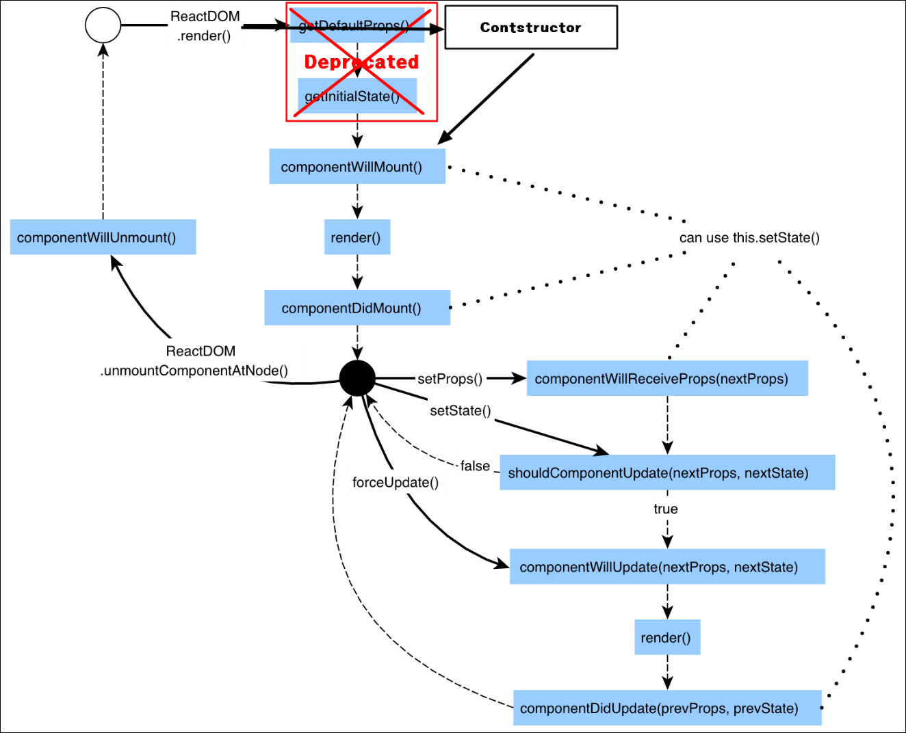
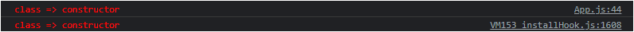

#### 02. [리액트 클래스 스타일 vs 함수 스타일](../README.md) >>>

---

## 04. 클래스에서 라이프사이클 구현하기

* 프로젝트: [react-func-class-style-coding](../react-func-class-style-coding)

   

### 4-1 클래스에서 라이프사이클 구현하기

* 동영상: https://youtu.be/VgbMW2f5laM


**리액트 컴포넌트의 라이프사이클**




#### componentWillMount

```
16.3, use componentDidMount or the constructor instead; will stop working in React 17
```

componentDidMount 또는 생성자를 사용하라고 함.. React 17에서 동작이 지원되지 않음.. 일단 지금 React 환경은.. package.json을 보니... 18.2.0임.. 경고는 뜨는데 콘솔 로그을 찍어봤을 때.. 실행이 되긴함 😅

```
react-dom.development.js:86 Warning: componentWillMount has been renamed, and is not recommended for use. See https://reactjs.org/link/unsafe-component-lifecycles for details.

* Move code with side effects to componentDidMount, and set initial state in the constructor.
* Rename componentWillMount to UNSAFE_componentWillMount to suppress this warning in non-strict mode. In React 18.x, only the UNSAFE_ name will work. To rename all deprecated lifecycles to their new names, you can run `npx react-codemod rename-unsafe-lifecycles` in your project source folder.

Please update the following components: ClassComp
```

생성자에다 넣어봤는데..

```javascript
class ClassComp extends Component {
  constructor(props) {
    super(props);
    console.log('%cclass => constructor', classStyle);
  }
  ...
}
```

콘솔로그상으로는 



꼭 두번 호출된 것 처럼 나타남?

그런데.. 224쪽 보니 책에보니 이에 대한 언급이 있다..


#### componentWillUpdate

```
react_devtools_backend.js:2655 Warning: componentWillUpdate has been renamed, and is not recommended for use. See https://reactjs.org/link/unsafe-component-lifecycles for details.

* Move data fetching code or side effects to componentDidUpdate.
* Rename componentWillUpdate to UNSAFE_componentWillUpdate to suppress this warning in non-strict mode. In React 18.x, only the UNSAFE_ name will work. To rename all deprecated lifecycles to their new names, you can run `npx react-codemod rename-unsafe-lifecycles` in your project source folder.

Please update the following components: ClassComp
```

이건 데이터를 가져오는 코드나 side effect 들을 componentDidUpdate 여기로 옮기라고 함.


**라이플 사이클 함수가 두번씩 호출되는 이유**는 ...  strict 모드가 설정되어있을 때... 개발환경에서 두번 호출해서 그렇다고 함..

* https://ko.reactjs.org/docs/strict-mode.html#detecting-unexpected-side-effects

* index.js

  ```react
  const root = ReactDOM.createRoot(document.getElementById('root'));
  root.render(
    <React.StrictMode>  <!-- 이걸 제거.. -->
      <App />
    </React.StrictMode>,
  );
  ```


Class 방식에서...

* 페이지가 랜더링 되기 전에 해야할일은 생성자에 구현
* 랜더링 후에 해야할일은 componentDidMount에 구현


페이지 처음 진입시...

1. class => constructor
2. lass => componentWillMount (여기 쓸 내용은 생성자(`constructor`)에 두라고 한다.)
3. class => render
4. class => componentDidMount


random 버튼을 클릭했을 때...

1. class => shouldComponentUpdate
2. class => componentWillUpdate (여기 쓸 내용은... React 17이상에서는 `componentDidUpdate()`에 두라고 한다. )
3. class => render
4. class => componentDidUpdate


### 4-2 함수에서 라이프사이클 구현하기 - 실습 준비

* 동영상: https://youtu.be/cJFLZUV4iLs

render 함수 내에 console.log 추가함.

```react
const funcStyle = 'color:yellow';
let funcId = 0; // render()가 호출될 때마다 증가..

function FuncComp(props) {
  ...
  console.log(`%cfunc => render ${++funcId} `, funcStyle);
  return (
  ...
  )
}
```


### 4-3 함수에서 라이프사이클 구현하기 - useEffect

* 동영상: https://youtu.be/LgEJlKfHJW0


### 4-4 함수에서 라이프사이클 구현하기 - clean up

* 동영상: https://youtu.be/s_i7yi8W3z8


### 4-5 함수에서 라이프사이클 구현하기 - skipping effect

* 동영상: https://youtu.be/d-UtrSSj5gA


## 의견

* 
  
  

---

## 정오표

* 없음
