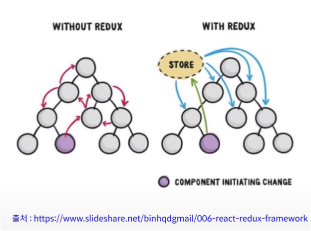

#### 05. [React Redux](../README.md) >>>

---

## 01. 수업 소개

* 프로젝트 디렉토리: [react-redux](../react-redux)

* 동영상 강의: https://youtu.be/fkNdsUVBksw

   

- [x] [Redux](../redux)
- [x] [JavaScript Innutability](../javascirpt-immutability)
  * 둘 다 모두 보았는데, 도움이 많이되었다. 😄

## 진행

* Redux를 사용하지 않을 때.. 데이터가 계층관계를 따라 내려거오가 올라감.
  * 전해지는 소문과 같은?
* Redux를 사용하면 Redux가 중앙에서 전역적으로 데이터를 관리해줌.
  * 언론 미디어 같은?
  * Redux만 쓰면 전체 컴포넌트에게 방송하는 비효율성이 있지만. react-redux를 사용하면 그 소식이 필요한 컴포넌트에게 전달 할 수 이음.
    * react-redux : React와 Redux를 연결해주는 라이브러리

## 의견

* 파트 5도 잘해보자! 😄

  

---

## 정오표

* 없음
