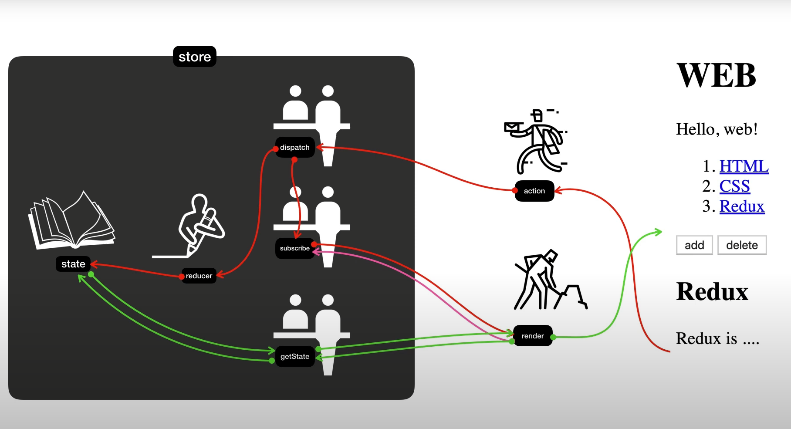

# WEB - Redux

> React Redux 파트의 선수 주제가 Redux라서 시작 

* 동영상 목록: https://www.youtube.com/playlist?list=PLuHgQVnccGMB-iGMgONoRPArZfjRuRNVc
* 연습 프로젝트: [redux](redux)


---

## 18.


---

## 17.


---

## 16. Redux - 7.6. 실전 Redux : 글 생성 기능 구현

* https://youtu.be/Ah_-BUs4uW8
* 영상에서는 CHANGE_MODE 대한 언급이 없었던 것 같은데.. .
  * 저자님 작성하신 소스코드 좀 참고 했다... 
    * https://github.com/egoing/redux-tutorial-example/blob/master/main.html


---

## 15. Redux - 7.5. 실전 Redux : subscribe를 통해서 자동 갱신 되도록 처리

* https://youtu.be/zMTqWoe25aU
* 현재 선택된 항목에 따라 article 변경
  * article의 갱신은 subscribe()에 article()함수 등록


---

## 14. Redux - 7.4. 실전 Redux : action을 dispatch를 통해서 전달하기

* https://youtu.be/ldxFOG4GfLk
* nav의 목록 클릭시 현재 선택한 목록 id를 redux에서 관리하도록 설정
* action 타입으로 SELECT 정의


---

## 13. Redux - 7.3. 실전 Redux : store 생성과 state 사용하기

* https://youtu.be/NK7p71gDVTU
* TOC의 정보를 Redux로 관리


---

## 12. Redux - 7.2. 실전 Redux : 부품화

* https://youtu.be/HmOSizB0vKw
* 정적 페이지에서 각 요소 부품화
  * [redux/main.html](redux/main.html)


---

## 11. Redux - 7.1. 실전 Redux : 정적인 웹페이지 만들기

* https://youtu.be/MqdUNIWMhbc
* 정적 페이지 작성
  * [redux/main.html](redux/main.html)


---

## 10. Redux - 6. Redux 선물 : 시간여행과 로깅

* https://youtu.be/dNPyoHW1A8A

* Redux Dev Tools 재생이 안되서 보니...

  ```javascript
    const store = Redux.createStore(
      reducer,
      /* preloadedState, */ window.__REDUX_DEVTOOLS_EXTENSION__ &&
        window.__REDUX_DEVTOOLS_EXTENSION__(),
    );
  ```

  * 두번째 인자로 옵션을 더 전달해줘야함. 😓
  * https://github.com/reduxjs/redux-devtools/tree/main/extension#11-basic-store
  * 붐비치 게임리플레이가 이런식으로 되어있을 것 같음


---

## 09. Redux - 5.3. Redux의 적용 : state의 변화에 따라서 UI 반영하기

* https://youtu.be/SnND3Fj3eJc

* state 변경시 랜더링을 위해 subscribe() 함수에 컴포넌트 랜더링 함수(red(), blue(), green() 같은..) 등록

  

---

## 08. Redux - 5.2. Redux의 적용 : reducer와 action을 이용해서 새로운 state 값 만들기

* https://youtu.be/6n4MCp4pI5A

* 가장 중요한 부분

  ```javascript
  function reducer(state, action) {
    console.log(state, action);
    if (state == undefined) {
      return { color: 'yellow' }; // 초기 state 값.
    }
    let newState;
  
    if (action.type === 'CHANGE_COLOR') {
      newState = Object.assign({}, state, { color: 'red' }); // 기존 상태는 보존하고 새로 복사해서 리턴하게 한다., 가장 중요한 부준.
    }
    return newState;
  }
  ```

  * state를 직접 수정하지 않고, 복사본을 만들어 그것의 상태를 바꾸고 반환한다.


---

## 07. Redux - 5.1. Redux의 적용 : store 생성

* https://youtu.be/8EhmwDKSeJQ
* Redux 공식 홈페이지
  * https://redux.js.org/
* Redux CDN
  * https://cdnjs.com/libraries/redux

* Redux를 사용해서 store를 생성하고 state값을 설정하고 그것을 사용하게 함.
  * [redux/with-redux.html](redux/with-redux.html)

---

## 06. Redux - 4. Redux가 없다면

* https://youtu.be/bn-8isrtx0k

* Redux를 사용하지 않는 상태에서의 컴포넌트 색깔 변경 예제

  * [redux/without-redux.html](redux/without-redux.html)
  * 확실히 복잡하긴 함.. 😓

  

---

## 05. Redux - 3. Redux가 좋은 가장 중요한 이유

* https://youtu.be/ijdFixuK1nI

* 크롬 확장도구: Redux DevTools
  * https://chrome.google.com/webstore/detail/redux-devtools/lmhkpmbekcpmknklioeibfkpmmfibljd
  * 상태변화를 녹화되어 과거 상태로 돌아가거나 재생해볼 수 있음.

---

## 04. Redux - 2.3. 리덕스 여행의 지도 : action과 reducer

* https://youtu.be/F_NLNBOqZrQ


---

## 03. Redux - 2.2. 리덕스 여행의 지도 : state와 render의 관계

* https://youtu.be/1U0vBNHyKaw
* store: 저장소
* state: 실제 정보
  * 직접 접속이 금지됨
* reducer
* render
  * UI를 만들어주는 사용자가 작성할 코드
* 앞단 창구 직원들..
  * dispatch
  * subscribe
  * getState


---

## 02. Redux - 2.1. 리덕스 여행의 지도 : 소개

* https://youtu.be/N9PT9iNTZAE

  

​		* 위 그림이 중요하다고 하심...


---

## 01. Redux - 1. 수업소개

* https://youtu.be/Jr9i3Lgb5Qc

* 뭔가 Java에서 불변 격체 만들어서 사용했던 생각이 났다.

* 공통 저장소를 쓰는건 프로그램이 DB를 사용하는 것 같은데... 그러나 구독으로 변경을 감지하여 일괄 적용하는 것은 좀 새로운 것 같고...

* 기타 영상

  * 코딩애플: React 입문자들이 알아야할 Redux 쉽게설명 (8분컷)
    * https://www.youtube.com/watch?v=QZcYz2NrDIs
    * 다른 영상인데.. 설명을 아주 쉽게 잘했다. 👍


